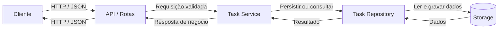

# Arquitetura

```mermaid
flowchart LR
    Client[Cliente]
    API[API / Rotas]
    Service[Task Service]
    Repository[Task Repository]
    Storage[(Storage)]

    Client -->|HTTP / JSON| API
    API -->|Requisição validada| Service
    Service -->|Persistir ou consultar| Repository
    Repository -->|Ler e gravar dados| Storage
    Storage -->|Dados| Repository
    Repository -->|Resultado| Service
    Service -->|Resposta de negócio| API
    API -->|HTTP / JSON| Client
```
